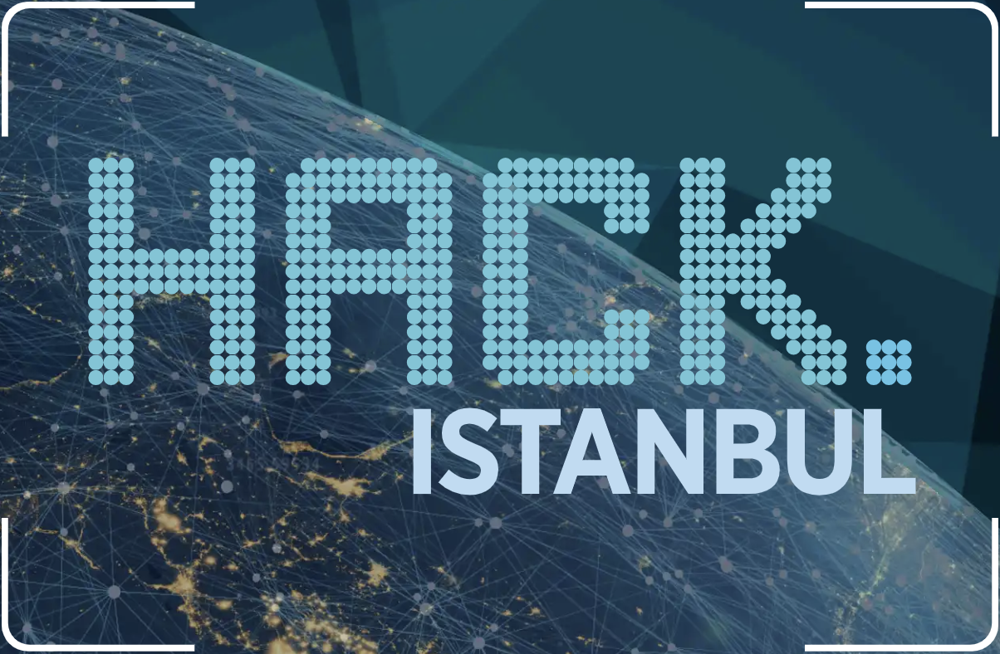

# Backend

This repository contains a RESTful HTTP API, also a Spring Boot application. This API offers capabilities to track emotional analysis of journeys.

The project is developed at Mercedes - Benz Hack.Istanbul 2018 event!

# What it does?

- The API accumulates emotional analysis information for each journey.
- An overall emotional analysis is calculated for each journey.
- Historical information can be queried through a dashboard, hosted at http://smalldata.surge.sh/dashboard

# How to use?

The API is hosted at https://smalldata-hack.herokuapp.com/

For API reference, browse to https://smalldata-hack.herokuapp.com/swagger-ui.html , where each endpoint has detailed explanation.

# Team Small Data

- Ramazan Zor
- Erkan Tomruk
- Oguzhan Unlu

# License

The MIT License
